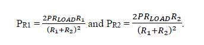
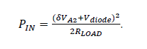

# Calibration Techniques and Additional Notes on “A Wideband Dummy Load with High Accuracy Wattmeter”
# Bob Fontana AK3Y

## Design Description
There are numerous techniques available for measuring the power from an RF source. These include bolometers (i.e., thermistors and barretters), thermocouple sensors and diode detectors to name the most commonly used. A very good introduction to these various techniques can be found in the Hewlett Packard Application Note 64-1 from 1977 which can be found on the Web at
http://hparchive.com/Application_Notes/HP-AN-64-1.pdf

Bolometer and thermocouple techniques require rather exotic devices and correspondingly complex mounting and instrumentation. Diode detectors, on the other hand, are much easier to implement; and, with the availability of low cost, high performance Schottky barrier devices, can be used with high accuracy well into the microwave region.

In this project, we use one or more 1N5711 Schottky barrier diodes together with circuitry to accurately and repeatably measure the peak RF voltages detected across a broadband, microwave flange resistor dummy load. By digitizing the resultant detected voltage with a low-cost Arduino microcontroller, suitably calibrated as discussed below, a very wideband, high accuracy wattmeter can be built at very little cost.

## Component Selection
In building this project, there are several choices that need to be made, some for the detector board and others for the Arduino controller board. Let’s first look at the easier of the two, the Arduino controller or Wattmeter Processor Board (cf. Figure 1 below).

On the Wattmeter Processor board, there are provisions for adding a 5V regulator (7805) to allow the unit to be powered from any 7-35V battery or wall adapter. The regulator provides a nice, clean 5.0V supply with 2% regulation to the Arduino microcontroller and attached OLED display. The 7805 has an approximate 2V linear drop-out, so you will need at least 7V to get a clean 5V output. Capacitors C2 (0.33 μF) and C2 (0.1 μF) are there for stability. No heat sinking is required.

Alternatively, the 7805, C2 and C3 can be omitted and the entire unit powered from the USB connector on the Arduino itself.

Secondly, provisions are made for the addition of a 5.6V Zener diode and bypass capacitor C1 (0.1 μF) which can provide additional protection for the Arduino A/D converter input from the Detector Board. Consider using these components if you anticipate any conditions under which the RF Power input might exceed (albeit briefly) the design limit discussed further below.

Figure 1. Wattmeter Processor Board

Moving on to the Detector Board (cf. Figure 2 below), there are also a few choices to be made.

Figure 2. Detector Board

### (a) Diode selection and installation
First of all, it’s important to note that the 1N5711 Schottky barrier diode has a maximum peak inverse voltage (PIV) of 70 volts. When used as a half wave rectifier, as in this application, the maximum peak voltage input cannot exceed 50% of this PIV value, since
on the negative RF cycle, the filter capacitor voltage adds to the peak forward voltage and reverse biases the diode.

So, if a single 1N5711 is used, the maximum peak RF input voltage is limited to 35 Volts, which corresponds to a maximum RF power input level of 12.25 Watts. This may be more than adequate for use with handheld and some mobile radios.

With two diodes in series, the maximum RF power is limited to 49 Watts; with three diodes 110.25 Watts.
Also note that the maximum voltage across the RF filter capacitor (C1 or C2, see further below) is equal to 35 Volts with a single 1N5711, 70 Volts with two diodes, and 105 Volts with three diodes. So, the SMD capacitors need to be rated appropriately.

Looking at the circuit board, there are several methods that can be used for installing one or multiple detector diodes:
- In the case of a single diode, it can be soldered at the position marked D1 on the circuit board, and C1 is used for filtering. No other parts or modifications need to be made.
- For two diodes in series, this can be done in a couple of different ways: (a) the two diodes can be soldered in series (as was done in Figure 2) and positioned at D1 with capacitor C1 installed; or (b) one diode can be soldered at position D1, the circuit board trace at position D2 is then cut with an Xacto knife, and the second diode soldered in position D2. In this second case, C1 is NOT installed, but rather C2 is installed.
- For three diodes, a combination of these techniques can be used; i.e., solder two diodes together at D1, cut trace at D2, solder the third diode at D2, and install C2.

This covers all possible cases up to a 100 Watt limit. It is recommended not to exceed 100 Watts due to the “smallish” size of the heat sink.

### (b) Resistor selection for Resistive Divider

In order to keep the detected voltage to a value below the maximum voltage rating for the Arduino’s A/D converter inputs, it is necessary to attenuate the filtered diode output. This is simply achieved with a resistive voltage divider consisting of R1 and R2 on the Detector board.

We know that the RF input power P and peak detected voltage Vp are related by the equation P = Vp2/(2*RLOAD). This peak voltage is then imposed across the series combination of R1 and R2. From Ohm’s Law, the powers PR1 and PR2 dissipated in these resistors (ignoring the loading effects of the Arduino gate input) are therefore given by:

and

There are several constraints that we would like to meet. First of all, we want to make sure that R1 and R2 have negligible loading effects on the circuit; so, we want the sum of these two resistances to be much larger than RLOAD:

(1)

And, as mentioned above, we want to make sure that the voltage across R2 never exceeds the maximum input level for the Arduino, namely 5V. This implies that
    
(2)

And, lastly, we want to make sure that the powers dissipated in R1 and R2 do not exceed their ratings as well. These can be calculated as:

(3)

Finally, the ATMega328P chip specifications recommend, for best accuracy, that the source impedance driving the A/D converter inputs be no greater than 10 kΩ.

Now, depending upon the number of Schottky diodes we end up using in the detector, the wattmeter can handle different power levels (see discussion further below).

If we pick, for example, a resistance R2 equal to 5600Ω, then we easily satisfy equation (1) while keeping the resistance seen by the Arduino less than the specified 10kΩ. From equation (2), setting RLOAD equal to 50Ω, and simplifying, we get
𝑅1𝑅2+1>2√𝑃.

For a 100W capability (3 diodes – see below discussion), then, R1 > 19 R2. So, with R2 selected to be 5600Ω, R1 > 106.4kΩ. For a 49W capability (2 diodes), R1 > 13 R2 or 72.8 kΩ. For my unit, I selected R2 = 100 kΩ.
Finally, from equation (3), the power dissipations in the divider resistors for a 100W input power level are PR1 = 0.09W and PR2 = 0.005W which implies that 1/8W resistors will work just fine in our circuit.

## Calibration Procedure

Looking at the schematic for the RF power sensor without the Arduino board attached (see Figure 3 below), if a DC voltage Vin is applied to the RF Input terminal, then both the diode drop(s) and the resistive divider ratio can be determined by measuring (a) the voltage V1 from C1 to GROUND (or C2 to GROUND if the trace is cut), and (b) the voltage V2 from the junction R1-R2 to GROUND, respectively.

That is:

and

Note that the Divider Ratio δ is also equal to (𝑅1+𝑅2)/𝑅2.

Also, the resistance RLOAD of the flange resistor can also be measured with a VOM attached to the RF Input terminal. (The parallel effects of R1, R2, and the Schottky barrier diodes are negligible when measuring RLOAD.)

Figure 3. RF Power Sensor Schematic

If the RF Input has a power of PIN, then the voltage that one would measure at terminal A2 (the input to the A/D converter pin on the Arduino microcontroller), is given by the relationship:

where 𝑉𝑖𝑛𝑝𝑒𝑎𝑘 is the peak input voltage since this is the voltage stored by the filtering capacitor (C1 or C2) and δ is the Divider Ratio.

However, the input power is simply

From the above relationships, the input power can then be computed as a function of the measured voltage VA2, the Divider Ratio δ, the diode voltage drop(s) Vdiode and the load resistance RLOAD as follows:

(1)

δ, Vdiode and RLOAD were measured with DC voltage measurements as mentioned above.
Unfortunately, there are several problems with this approach:

- the forward voltage drop across the Schottky barrier diodes Vdiode increases as the current increases (typical diode “knee”), so as the input power increases, so does Vdiode. The above equation assumed that Vdiode was constant and not a function of input power level;
- the formula for the Divider Ratio δ assumed a very large input impedance for the Arduino’s A/D converter input. In fact, the ATMega328P datasheet claims an analog input impedance of 100 MΩ. However, this is not quite true as the input resistance is significantly lower during the interval of time in which the internal sampling capacitor charges up. This shunting impedance can result in a few percent error in measured power if using the above equation; and,
- the measured value VA2 (i.e., the value that the Arduino reports from its 10 bit A/D converter) is a function of the chip’s internal reference voltage (nominally 3.3V) which varies slightly from chip to chip and as a function of the chip’s supply voltage.

Let’s address each of these error sources in turn.

### Forward Diode Voltage Drop
With two 1N5711 diodes in series, I measured the following values for the diode forward voltage drop as a function of applied input voltage Vin:

|Vin(V)|Vdiode(V)|Power(*)|
|------:|---------:|--------:|
2.11|0.448|44.5 mW|
5.15|0.500|265 mW|
9.02|0.530|813 mW|
15.2|0.560|2.31 W|
20.0|0.570|4.00 W|
28.9|0.580|8.38 W|

(*) The value of Power in the last column is the power corresponding to a peak RF voltage equal to the applied DC voltage Vin.

Table 1. Vdiode vs Power Input

As expected, the diode(s) voltage drop increases with increasing power input. However, what is the resultant error if we assume that this voltage drop is constant?

#### Let’s look at a specific example.

With two Schottky barrier diodes in the detector circuitry, each having a manufacturer specified reverse breakdown voltage of 70V (1N5711), the maximum peak voltage that the diodes can safely detect is also 70V (since the effect of the filtering capacitor is to effectively double the peak inverse voltage across the diodes on the negative swing of the RF cycle). A peak of 70V corresponds to an input power level of 49 Watts.

Now, the Arduino analog inputs have a maximum voltage rating of 5V. In order that the maximum detector voltage does not damage the Arduino input, it is thus necessary to reduce the peak voltage by at least the ratio 70/5 or 14. To be conservative, let’s pick a slightly larger value of 15 for our Divider Ratio δ.

Using our previous diode measurements (Table 1), one can determine the input voltage VA2 to the Arduino using equation (1) above (50Ω load resistor):

|Vin(V) | Vdiode(V) | Power(*) | VA2 |
|---:|---:|---:|---:|
2.11 | 0.448 | 44.5 mW | 0.112 |
5.15 | 0.500 | 265 mW | 0.310 |
9.02 | 0.530 | 813 mW | 0.566 |
15.2 | 0.560 | 2.31 W | 0.976 |
20.0 | 0.570 | 4.00 W | 1.295 |
28.9 | 0.580 | 8.38 W | 1.891 |

Table 2. VA2 vs Power Input

Given these numbers (which dynamically take into account the diode voltage as a function of power level), let’s look at the % error that occurs if we use a FIXED value for Vdiode in our power estimation (see Table 3 below).

Note that, from the above table, 0.560V is the numerical average of the measured diode forward voltages over the power range 44 mW to 8.38 Watts.

| Vin(V) | Vdiode(V) | Power(*) | VA2 | % error Vdiode = 0.560 | % error Vdiode = 0.500 |
|---:|---:|---:|---:|---:|---:|
2.11 | 0.448 | 44.5 mW | 0.112 | 12.8 | 6.80 |
5.15 | 0.500 | 265 mW | 0.310 | 2.43 | 0.00 |
9.02 | 0.530 | 813 mW | 0.566 | 0.74 | 0.59 |
15.2 | 0.560 | 2.31 W | 0.976 | 0.00 | 0.77 |
20.0 | 0.570 | 4.00 W | 1.295 | 0.15 | 0.75 |
28.9 | 0.580 | 8.38 W | 1.891 | 0.16 | 0.57 |

Table 3. %Error vs Power Input for Fixed Values of Vdiode

As can be seen from Table 3, if one sets Vdiode equal to the average of the measurements taken, the error in the power measurement is less than 1% for power levels greater than about 800 mW or so, but exceeds 10% at QRPp levels around 50 mW. If better accuracy is needed at very low power levels, then it is better to pick a value for Vdiode which is measured at lower applied voltage levels (as seen in the last column of this table).

However, what these results do show is that it is not necessary to be too concerned about choosing a fixed value for Vdiode, and a numerical average over several power levels (i.e., in the range of values you expect to see in your application) works quite nicely over all but the lowest QRPp levels.

#### Divider Ratio

The resistive divider is used to reduce the voltage levels into the Arduino digitizer to safe values so as not to exceed the maximum specified input voltage of 5V. Unfortunately, while the Arduino specifications indicate an extremely high input impedance level of ~ 100 MΩ, in practice, this is not the case, and the actual impedance is orders of magnitude lower. This can have a significant effect on the accuracy of the power measurements.

For example, I used two 5% carbon resistors in the resistive divider; one (nominal 100 kΩ) measured 96,500 Ω, while the second (nominal 5600 Ω) measured 5560 Ω. This produced a divider ratio of (96500+5560)/5560 = 18.3561. When this value was used in the software, the power levels measured came out a few percent lower than what was measured on my Agilent power sensor.

If δ is the correct Divider Ratio, and δ* is the Divider Ratio used in the Arduino code, then it can be shown that

(2)

where VA2 is the input voltage to the Arduino digitizer at the power level PTRUE. (The approximation is valid at power levels greater than a few hundred milliwatts.). Measuring the same output power on an Agilent power sensor and with the device under test, the correct value for the Divider Ratio can be gotten from this equation.

In my case, the DC measurement of the Divider Ratio gave a value of 18.3561; however, using the above equation, the true Divider Ratio should have been 19.4905, an appreciable difference. Consider the equivalent circuit below (Figure 4).

Figure 4. Equivalent Circuit

Recall that R1 = 96500 Ω and R2 = 5560 Ω. Let R be equal to the parallel combination of R2 (the bottom leg of the resistive divider) and the Arduino’s analog input impedance Zin. We then see that (96500+𝑅)/𝑅=19.4905 or, solving for R, R = 5218.9 Ω.

But R is the parallel combination of 5560 Ω and Zin, so this implies (using the formula for parallel resistors) that Zin = 85087 Ω which is considerably smaller than the manufacturer’s specified 100 MΩ!

>The spec sheet for the ATMega360P recommends that whatever source is connected to the Arduino analog pins has an output impedance of 10 kΩ or less for best accuracy. This warning is certainly supported by this example.

While 85 kΩ is still a fairly high input impedance, and most likely suitable for many Arduino applications, it is still small enough to have a deleterious effect on power measurement accuracy in our application.

In this example, power measurement errors due to errors in the Divider Ratio (i.e., by neglecting the effects of Arduino analog input loading) were approximately 5.8%. While this is not a tremendously bad error, we can completely eliminate it or reduce it substantially with a single accurate power measurement.

If an accurate (external) power measurement cannot be gotten, one can approximate the Arduino loading by assuming an 85 kΩ input impedance. (If 100 kΩ is assumed, the error is only 0.8% so this is not a very critical value, but it is certainly nonnegligible and much less than 100 MΩ.)

In summary, the Arduino’s analog input exhibits a lower impedance during the charging of its input capacitor in making an A/D measurement. One then needs to modify the Divider Ratio by either (a) making an accurate power measurement using another power meter and using equation (2) above; or (b) assuming an Arduino input impedance of 85 kΩ to 100 kΩ and modifying the Divider Ratio to compensate for this parallel effect in the resistive divider.

#### A/D Converter Reference
The Arduino’s analog inputs are 10-bit A/D converters (ADC) which use a successive approximation algorithm to digitize the input voltage. From the ATMega328P data sheet, the digital output value is given by the closest integer to

where Vref is the reference voltage used by the chip, typically 5V.

However, as our RF power estimate is proportional to the square of the voltage on pin A2 of the Arduino, any error in Vref is multiplied by a factor of 2 in the power estimate. So, it would be nice to have an accurate measurement of this A/D reference voltage.

Fortunately, the Arduino Nano also has a 3.3V output which is created by a Low Dropout (LDO) regulator within the onboard FT232 UART chip. This voltage is quite stable with fluctuating Vcc and can be used to essentially calibrate the A/D converter.

To accomplish this, the 3.3V reference voltage (V3.3) on Arduino pin 2 (denoted 3V3) is first measured using an external VOM. This value is then input to the software (#define V33 statement in the header). The 3V3 pin is connected to a second Arduino A/D converter (pin A1) and this reference voltage is digitized and averaged (ITERATIONS value in header) giving a value of Nave. From this measurement, one can then deduce what the A/D converter is using for its reference value, since

### In summary, to calibrate the Dummy Load/Wattmeter:
- Measure the flange load resistance by using a good quality VOM across the RF Input terminal to ground. Set MYDUMMYLOADOHMS to this value in the header of the Arduino code;

- Without the Arduino controller board attached, measure the Divider Ratio δ in one of three ways:

    - (Least accurate method) Apply a voltage of approximately 5V or so across the RF Input terminal to ground, and measure the voltage VA2 at the output terminal marked A2 to ground; and the voltage VC measured at the top of capacitor C1 (single diode) or the top of capacitor C2 (two diodes) to ground. The Divider Ratio δ is equal to VC/VA2; or,
    - (Good accuracy method) Measure resistances R1 and R2 on the detector board and let Rp = R2 || 85kΩ (i.e., the parallel combination of R2 and 85kΩ). The Divider Ratio δ = (R1+Rp)/Rp; or,
    - (High accuracy method) Measure the course Divider Ratio δ* using the method a. above (Arduino controller board not attached). With another power meter of known and good accuracy, make a measurement of the power PTRUE from any RF source having a power level within the range of the Dummy Load/Wattmeter. Attach the Arduino processor board, and make the same measurement P with the Dummy Load/Wattmeter.
    Calculate the corrected Divider Ratio from the formula:

        
    
        For any of these three methods, set Vratio = δ in the header of the Arduino code.

- Again, with the Arduino controller board removed, apply voltages from approximately 2 to 30 Volts DC at the RF input. For each of these voltages (see above), determine the voltage drops across the Schottky barrier diodes. This voltage will increase with increasing applied input voltage. As discussed above, you have a few choices – (a) determine an average value for the diode(s) voltage drop, or (b) pick a diode voltage drop corresponding to an input power level near the center of the range of interest. (The detected power can be estimated from the applied DC input voltage Vin as Vin2/(2 RLOAD) where RLOAD is the flange resistance value from (1) above.)

    As mentioned above, this value is not very critical for measured power levels above a few hundred milliwatts, but if you want a unit which is particularly accurate at QRPp levels, you may want to pick a diode voltage toward the lower end of the range.
    
    Set #define DIODEVOLTAGEDROP to this value in the header code.
- With the Arduino controller board powered up, measure the voltage V33 at Pin 2 (denoted 3V3 on the module). Place this value in the code at #define V33.

## Additional Comments on Measured Performance
By itself, the RFR-50-250 flange-mounted resistor used in this project is rated at 250 Watts dissipation from DC to 1.7 GHz, with a specified VSWR of better than 1.5:1 from 30 to 300 MHz. Without the diode detector attached, we measured the VSWR as shown in Figure 5 below.

Figure 5. Input VSWR vs Frequency (Flange Resistor Only – No Detector)

VSWR is less than 2.0:1 from DC to beyond 2.5 GHz, and less than 1.5:1 from DC to 1150 MHz. Note that there were a few minor resonances in the 1200 to 1600 MHz range, most likely due to the lead inductances of the 1N5711 Schottky barrier diodes. Surface mount versions of these diodes are also available, and their use may reduce or eliminate these resonances; however, the VSWR was still below 2.0:1 in this range.

With diode detector circuity attached (this is the result for two diodes in series to provide for input power levels up to approximately 50 Watts), we obtained the following curve (Figure 6).

Figure 6. Input VSWR vs Frequency (2 Diode Detector)

VSWR was better than 2.0:1 up to approximately 1360 MHz and better than 1.5:1 up to 755 MHz, allowing the unit to meet our frequency performance goal of good performance up to and including the 23 cm band.

### Ideas for Further Improvement
Here are a few suggestions for further improvements to this unit:

- The unit was shown to be extremely accurate for power levels above a few hundred milliwatts or so, and could be made even more accurate at QRPp levels well below 1 Watt by setting the parameter DIODEVOLTAGEDROP to correspond to the smaller forward voltage drop which occurs at those lower power levels.
One improvement would be to create a lookup table of diode voltage drops as a function of applied DC voltage at the RF input pin, and then, based upon the power estimate with a fixed value for DIODEVOLTAGEDROP, adjust this parameter to correspond more closely to the measured drop at that power level. This will have little effect above a few hundred milliwatts, but could dramatically improve accuracy in the 5 to 200 mW range.

- With a small thermistor attached to the flange resistor, it would be possible to measure the temperature of the device and, using the Arduino, control (via one of the PWM pins) a small fan to turn ON if the temperature exceeds some set value. This would be of some benefit in applications where extended power dissipation into the dummy load is required.

- As mentioned above, replacing the through-hole Schottky barrier diode(s) with surface mount versions may improve the frequency performance to well beyond the 23 cm band. Additionally, there are other flange resistors which are capable of good performance to 6 GHz, and a totally surface mount version may be of considerable use at those microwave frequencies.