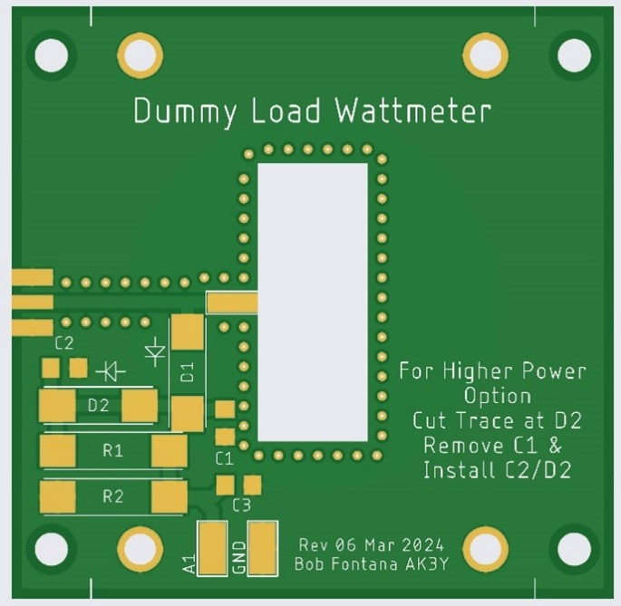
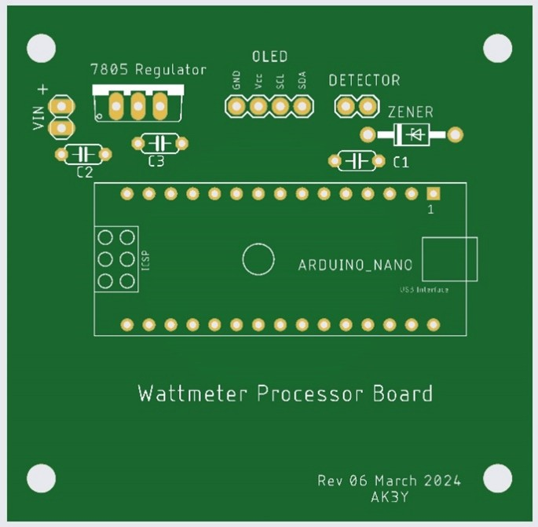

# Fontana (AK3Y) Wideband Dummy Load

## QST-in-Depth
As there is a direct connection from the RF connector to the microstrip input of the flange resistor termination, there is no low frequency limit for this dummy load/wattmeter.

Aliexpress.us is a good source for low cost, flange-mounted power resistors in a wide variety of power levels.

The printed circuit boards were designed in Autodesk Fusion 360 and fabricated by JLCPCB (https://jlcpcb.com).  I have used JLCPCB on several projects in the past. With their fast turnaround time of 5 to 7 days, very low cost and excellent product quality, it’s become a “no brainer” to have printed circuit boards made in this manner.

 

Figure 1 – Dummy Load/Detector PCB	    

Figure 2 - Arduino Controller PCB

## Parts List - Dummy Load Board
- SMA PCB edge-mounted connector (RF Input)
- Flange-Mounted Power Resistor RFR 50-250 (50Ω 250W) or equivalent (https://www.aliexpress.us/item/3256805603572821.html)
- D1, D2 – 1N5711 Schottky Barrier Diodes (Can use 2 or more diodes in series for higher power levels – see companion documentation)
- C1, C2 – 0.01 µF/100V SMD capacitor (see companion documentation)
- C3 – 1000 pF SMD capacitor
- R1 – 100 kΩ/1/4W carbon composition resistor (see companion documentation)
- R2 – 5600 Ω/1/4W carbon composition resistor (see companion documentation)
- Heatsink (not shown) 60x45x18 mm (https://www.aliexpress.us/item/3256805661725774.html)

## Parts List - Arduino Controller/Display Board
- U1 – Arduino Nano 3.0 with bootloader (https://www.aliexpress.us/item/3256805866900355.html)
- IC1 – 7805TV regulator (optional, see companion documentation)
- C1 – 0.1 µF/16V ceramic capacitor (optional, see companion documentation)
- C2 – 0.33 µF/16V ceramic capacitor (optional, see companion documentation)
- C3 – 0.1 µF/16V ceramic capacitor
- D1 – 5.6V Zener diode (optional, see companion documentation)
0.96 Inch OLED Display Module SSD1306 128X64 (Pin Headers Soldered) (https://www.aliexpress.us/item/3256804169233174.html)
- Four (4) Nylon or metal standoffs (to connect boards together) – shown with 0.8” standoffs tapped for #4 screws

## Calibration

For calibration process check the dedicated [document here](Calibration.md).